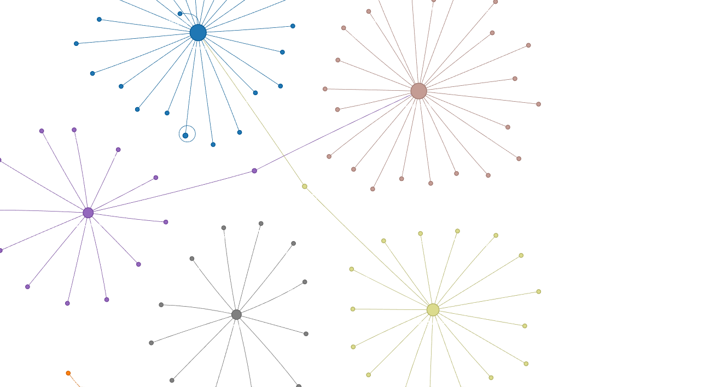
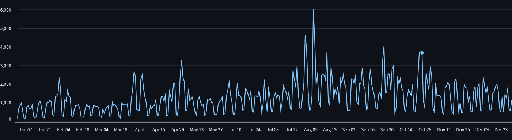
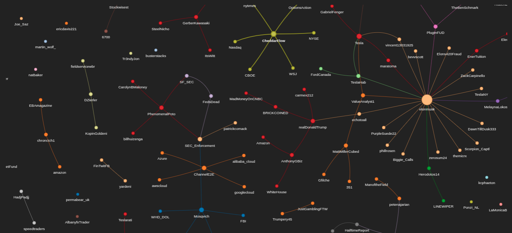

# Report: **Interactive Social Media Dashboard – Twitter Data Analysis**

# Part I: Application Description

### 1. Introduction

The objective of this project was to develop an interactive dashboard application using the **Streamlit** library to explore user interactions on the social media platform Twitter. The analysis focuses specifically on users’ opinions about various airlines—a critical aspect for the service sector, which continuously monitors customer satisfaction and responds to criticism in social media.

By utilizing an interactive analytical tool, users are able to explore data independently, filter based on selected criteria, and visualize results in real time. The project also incorporates basic graph visualization techniques to analyze communities and interactions between users.

### 2. Streamlit Interactive Application

The application was built using the **Streamlit** framework and features a user-friendly interface. Key features include:

- Filtering data by username

- **Interactive Components:**
  - Bar and pie charts (e.g., missing values, most frequent users)
  - Time series plots (e.g., number of tweets over time)
  - Filterable data table
  - Word cloud (most frequently used words in tweets)

### 3. Community Detection and Interaction Analysis

Although the dataset does not contain a complete network of user interactions, a simplified graph model was used:

- **Nodes**: Tweeting users  
- **Edges**: Mentions within tweets  

The libraries **NetworkX** and **Pyvis** were employed to visualize the user network. Influential users were identified based on retweet counts.

Methods applied:
- Visualization of user clusters using algorithms such as degree, closeness, and betweenness centrality
- Identification of key nodes
- Analysis of local structures and network cohesion

### 4. Limitations

- Incomplete interaction data (e.g., lack of replies and quote tweets)
- A small percentage of tweets contain geolocation information
- Potential errors in sentiment classification (e.g., sarcasm)
- The dataset is outdated, with most tweets from several years ago

### 5. Future Improvements

- Integrate the application with the **Twitter API** to enable real-time data analysis
- Expand the dashboard to include other platforms (e.g., Facebook, Reddit)
- Apply modern NLP models (e.g., **BERT**, **RoBERTa**) for better sentiment and context analysis
- Implement more advanced graph models (e.g., Graph Neural Networks)

### 6. Attachments

- [GitHub Repository with Application Code](https://github.com/SmallCelestial/ISMD)
- Data Source 1: [Kaggle – Twitter US Airline Sentiment](https://www.kaggle.com/datasets/crowdflower/twitter-airline-sentiment)
- Data Source 2: [Huggingface - Market Stock Tweets](https://huggingface.co/datasets/mjw/stock_market_tweets)

---

# Part 2: Data Analysis Examples

## Dataset 1 - Twitter US Airline Sentiment

### Dataset Description

The data was sourced from **Kaggle** and consists of tweets containing opinions about several U.S. airline companies. The dataset includes the following columns:

- `tweet_id` – unique tweet identifier  
- `text` – tweet content  
- `tweet_created` – timestamp of creation  
- `airline` – airline name  
- `airline_sentiment` – sentiment classification (positive, neutral, negative)  
- `airline_sentiment_confidence` – confidence of the sentiment classification  
- `negativereason` – reason for negative sentiment (if applicable)  
- `negativereason_confidence` – confidence of the reason classification  
- `retweet_count` – number of retweets  
- `tweet_coord`, `tweet_location`, `user_timezone` – geographic location information  

The dataset includes over **11,000 tweets**, mostly from around March 2015.

### Exploratory Data Analysis (EDA)

#### Sentiment Analysis

Sentiment distribution:

- Negative: ~62%  
- Neutral: ~21%  
- Positive: ~17%  

#### Most Common Reasons for Negative Sentiment

The most frequent complaints were:
- **Customer Service Issue**
- **Late Flight**
- **Cancelled Flight**
- **Lost Luggage**

#### Posting Time

Tweeting activity was consistent over time, peaking on January 22, 2015.

#### Geolocation

Many tweets lacked coordinate data (`tweet_coord`). However, based on `tweet_location`, **Boston** was identified as the most common location.

#### Airline Popularity

Most frequently mentioned airlines:
- United
- US Airways
- AmericanAir
- SouthwestAir
- JetBlue

This is visualized in the interaction graph below:

### Conclusions

- The majority of tweets expressed **negative sentiment**, indicating that Twitter is often used to voice dissatisfaction.
- The most common complaints concerned customer service and flight delays.
- United Airlines and US Airways received the most criticism.
- The interactive application enables dynamic analysis accessible even to non-technical users.
- A basic graph analysis revealed several highly influential users with broad reach.

## Dataset 2 - Stock Market Tweets

### Dataset Description

This dataset consists of over 1.7 million public tweets related to major tech stocks — Apple (AAPL), Amazon (AMZN), Google (GOOG), Microsoft (MSFT), and Tesla (TSLA) — posted between January 1, 2015 and December 31, 2019.

To improve performance and speed of data processing, a filtered subset is used, containing tweets from January 1, 2018 to January 1, 2019, with a total of 466,289 tweets.

Each tweet includes metadata organized into the following columns:

- tweet_id: Unique identifier for each tweet

- comment_num: Number of comments (replies)

- retweet_num: Number of retweets

- like_num: Number of likes

- ticker_symbol: Stock ticker symbol mentioned (e.g., TSLA, AAPL)

- tweet_created: Timestamp of when the tweet was posted

- text: The content of the tweet

- name: Username of the tweet author

### Exploratory Data Analysis (EDA)

#### Basic Statistics

- **Unique Users**: 31,140
- **Unique Tweets**: 466,289
- **Most Mentioned Ticker**: TSLA (247,701 tweets)
- **Most Active User**: Commuternyc (6,212 tweets)
- **Most Active Day**: August 7, 2018

The most frequently mentioned ticker is **TSLA** (Tesla), appearing in over **247,000 tweets**, which is more than half the dataset. This indicates a significantly high level of public interest in Tesla during the observed period.

On **August 7, 2018**, tweet activity peaked dramatically — this date corresponds with Elon Musk’s famous "funding secured" tweet about taking Tesla private, which sparked intense discussion across social media.

#### Tweet Engagement Metrics

| Metric         | Mean  | Std Dev | Min | 25% | 50% | 75% | Max |
|----------------|-------|---------|-----|-----|-----|-----|-----|
| Comments       | 0.72  | 2.75    | 0   | 0   | 0   | 1   | 631 |
| Retweets       | 0.84  | 6.32    | 0   | 0   | 0   | 0   | 894 |
| Likes          | 4.58  | 19.08   | 0   | 0   | 1   | 3   | 999 |

- The distribution of likes and retweets is highly right-skewed, with most tweets receiving minimal engagement.
- A significant portion of tweets received **0 comments and 0 retweets**, suggesting limited interaction.
- The presence of outliers is evident from the high maximum values, especially for comments and likes.

### 1. User Popularity (Degree Centrality)
*Higher values indicate users who interact with or are mentioned by the largest number of unique users.*

| User              | Degree Centrality |
|-------------------|-------------------|
| elonmusk          | 0.0409            |
| CheddarFlow   |0.0123            |
| Tesla           | 0.0123         |

### 2. User Proximity (Closeness Centrality)
*Higher values indicate users who can reach others in the network more quickly.*

| User              | Closeness Centrality |
|-------------------|----------------------|
| elonmusk          | 0.0436               |
| Tesla      | 0.0262               |
| CheddarFlow        | 0.0123             |

### 3. Bridging Role (Betweenness Centrality)
*Higher values indicate users who act as key bridges between different parts of the network.*

| User              | Betweenness Centrality |
|-------------------|------------------------|
| elonmusk          | 0.0058                 |
| echotoall   | 0.0019              |
| realDonaldTrump       | 0.0018                 |

This analysis of the filtered stock market tweet dataset (2018) reveals key patterns in user activity, engagement, and network influence.

- **Tesla (TSLA)** dominated the discussion, mentioned in over **half the tweets**, with a major spike on **August 7, 2018** following Elon Musk’s "funding secured" tweet. This highlights the strong market-moving power of influential individuals on social media.

- **User engagement** levels were generally low across the dataset. However, a small number of tweets generated significant traction, as evidenced by the presence of extreme outliers in likes and comments.

- From a **network perspective**, **Elon Musk** consistently ranked at the top across all centrality metrics:
  - He had the **highest degree centrality**, showing he interacted with or was mentioned by the largest number of unique users.
  - He also had the **highest closeness and betweenness centralities**, suggesting he is both centrally located in the network and acts as a key bridge between user clusters.

- Other users like **Tesla**, **CheddarFlow**, and **realDonaldTrump** also emerged as influential but with much lower centrality scores compared to Musk, reinforcing his outsized impact on stock-related discourse.

- The **network graph visualization** supports these findings, showing a centralized structure with prominent hubs surrounded by smaller, loosely connected communities.

Overall, the data illustrates how **a few influential figures can dominate discourse**, drive engagement, and shape the structure of conversation networks in the financial Twitter ecosystem.

Note: that only 500 users were selected for community graph analyzing because of computational time. 